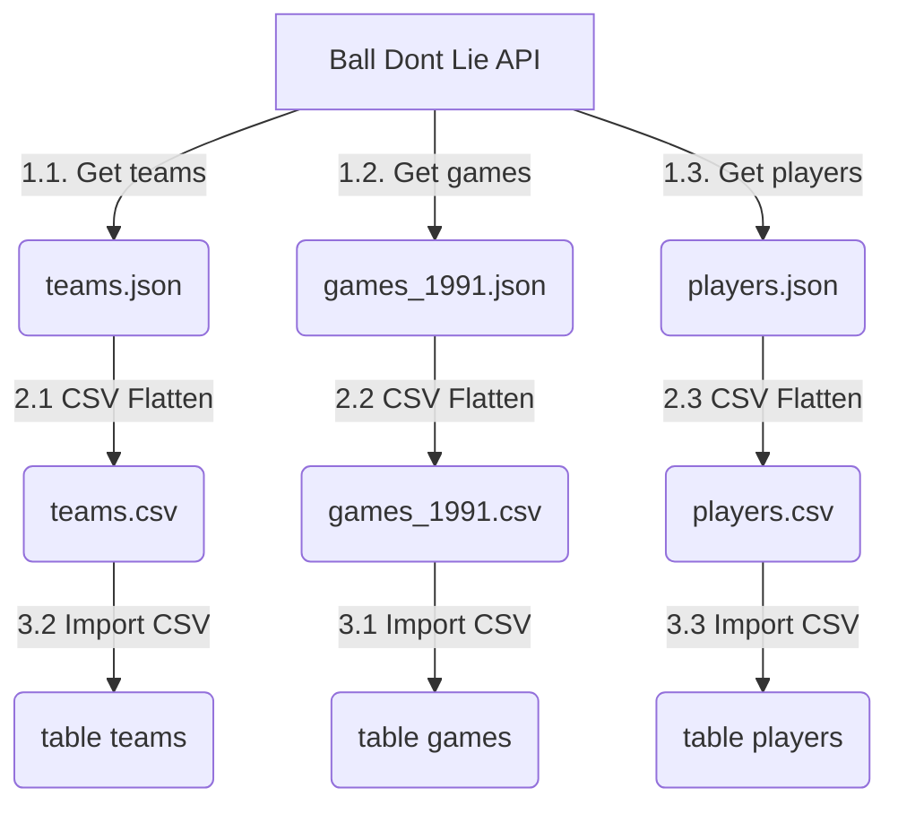

# data-analyst-full-project-adalab

Data for these exercises will be extracted from the API https://www.balldontlie.io/home.html#introduction
(Basketball database). It doesn't require registration nor API Key.


## 1. Data collection 
Create a python script or jupyter notebook that will retrieve data from the API and will store it as files in the local filesystem.
For this part of the exercise you will need:
- Python / Jupyter
- requests https://pypi.org/project/requests/
- JSON https://docs.python.org/es/3/library/json.html

### Exercise 1.1
Get all teams. https://www.balldontlie.io/home.html#get-all-teams  
Bear in mind pagination. It is possible to pass additional arguments to the API call. Example:
```
params_arg = {'player_ids[]': [170, 237, 115], 'season': 2014}
r = requests.get('https://www.balldontlie.io/api/v1/season_averages', params=params_arg)
```

### Exercise 1.2
It is required to obtain all games of the 1991-1992 season. No need to rename/remove fields from the response.

### Exercise 1.3
It is required to obtain all players. No need to rename/remove fields from the response.

### Output/Deliverables:
- For each exercise, a notebook in the folder `notebooks/` must be commited
- Create one reusable (shared across exercises) python function called `paginate_api_calls` that will handle the pagination of the API. It will accept two arguments (url, parameters)
- Create one reusable python function called `write_json_file` that will write the responses to disk
- Exercise 1: One JSON file containing __all teams__ in the folder `/data/teams`. Each row in this file will represent one API response. You can find an example in `sample/data/teams.json`
- Exercise 2: One JSON file containing __all games__ in the folder `/data/games`. Each row in this file will represent one API response. You can find an example in `sample/data/games.json`
- Exercise 3: One JSON file containing __all players__ in the folder `/data/players`. Each row in this file will represent one API response. You can find an example in `sample/data/players.json`
- Pagination must be dynamic. i.e. control pagination until the end.
- Git repository must not contain any JSON/CSV files


#### Key Points:
- Pagination. Each API call contains metadata that you can use to control it. I recommend to use the attribute `next_page`
`'meta': {'total_pages': 2, 'current_page': 1, 'next_page': 2, 'per_page': 30, 'total_count': 45}`
- Reducing the number of API calls to the maximum. There is a parameter to increase the number of items retrieved in each API call. By modifying it, you can reduce the total number of API Calls
- API Search/Query: Read the docs carefully

--------

## Database
You need a MySQL local database. There are multiple ways to get one up and running, I'm going to explain how to run it as a docker container.
- Step 1: Install Docker
- Step 2: Download an official mySql image.
```sh
# download postgres image
docker pull mysql:debian
```
- Step 3: Run a mysql container
```sh
# run a mysql container
docker run --name mysql -d -p 33060:3306 -e MYSQL_ALLOW_EMPTY_PASSWORD=yes -d mysql:debian
```

## 2. Data preparation
Create a python script that will convert the previously generated JSON files into flattened CSV files, for each of the three exercises above.
Sample files will be available in the folder `sample/data`


### Output/Deliverables:
- One flattened CSV file for each of the entities (teams, players, games)


## 3. Data ingestion
Using the python mysql connector, read and upload the previously generated CSV files into the MYSQL Database

### Output/Deliverables:
- Table DDLs (Create table statements) in the folder `sql/ddl/`
- Python code that creates the tables and ingests the data into the tables

#### Tools:
For this part of the exercise you will need:
- Python / Jupyter
- A MYSQL database in local machine with a DB Client (MYSQL Workbench or DBeaver: Database viewer (Open Source) https://dbeaver.io/download/)
- Docker (optional)

####


### Full Diagram
